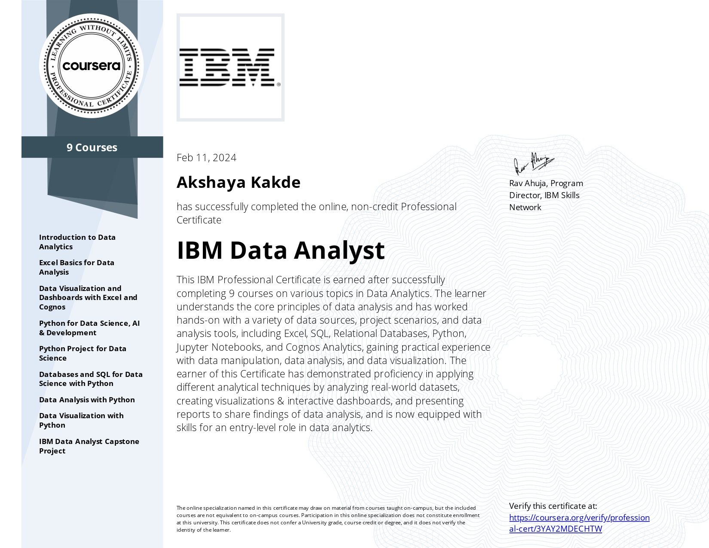
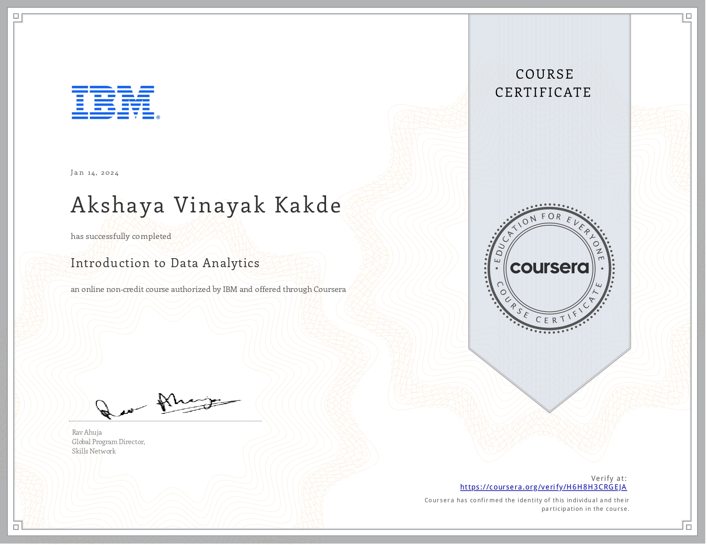
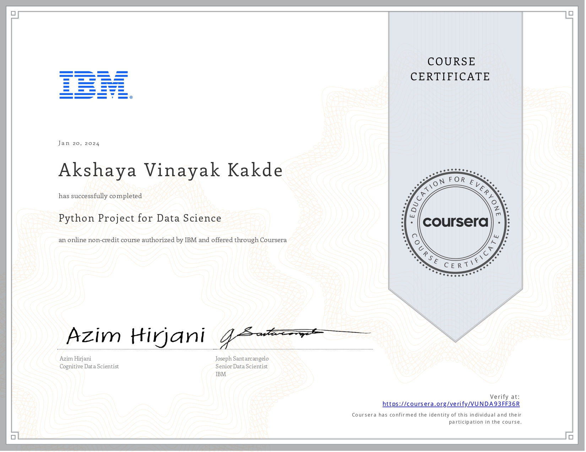
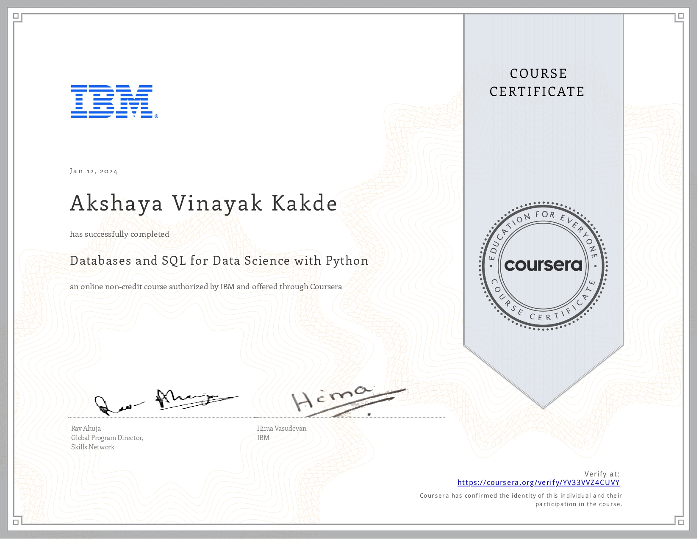
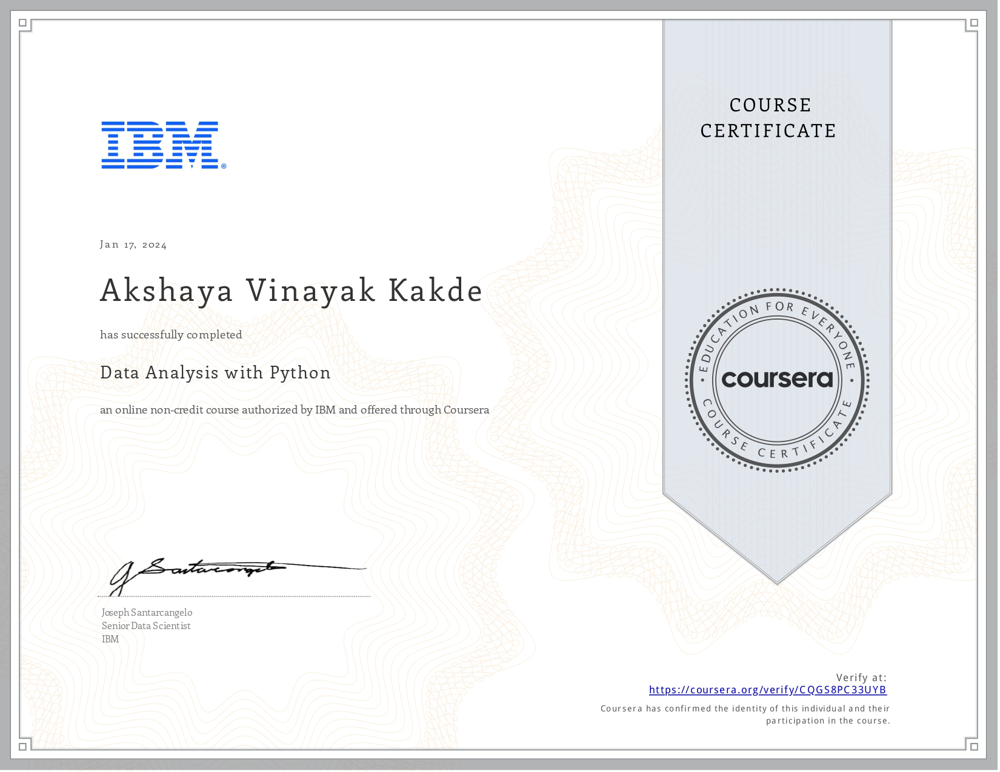
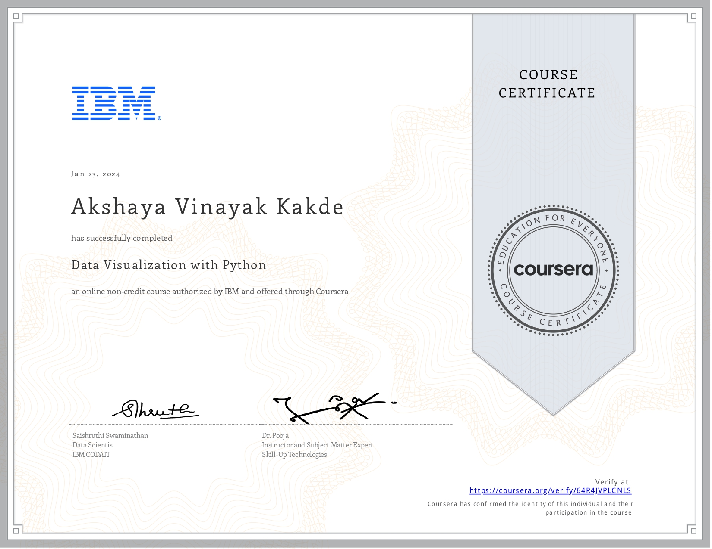

# IBM Data Analyst Professional Certificate 

📍 **About Professional Certificate**

I'm excited to share that I've recently completed the IBM Data Analyst Professional Certificate program on Coursera. This comprehensive curriculum has equipped me with the essential skills needed for an entry-level data analyst role. Through eight courses, I delved into the core principles of data analysis and gained hands-on experience with various data sources and analysis tools, including Excel, SQL, Python, Jupyter Notebooks, and Cognos Analytics.

📚 **What I've Learned :**

- Proficiency in utilizing Excel for tasks like data wrangling and mining.
- Creating charts and plots in Excel and building dashboards with IBM Cognos Analytics.
- Visualizing data using Python libraries like Matplotlib.
- Developing a working knowledge of Python for data analysis, leveraging libraries such as Pandas and Numpy, and utilizing APIs and Web Services.
- Understanding the data ecosystem and querying cloud databases using SQL and Python from Jupyter notebooks.

📍 **About My Applied Learning Projects :**

Throughout the program, I engaged in hands-on projects and labs to solidify my technical skills in data gathering, wrangling, mining, and visualization. Additionally, I honed soft skills such as stakeholder collaboration and storytelling with data. Some of the projects I completed include:

- Importing, cleaning, and analyzing fleet vehicle inventory using Excel pivot tables.
- Creating an interactive dashboard with visualizations based on car sales key performance indicator (KPI) data.
- Extracting and graphing financial data using Pandas.
- Querying census, crime, and school demographic data sets with SQL.
- Developing regression models to predict housing prices using Python data science libraries.
- Designing a dynamic Python dashboard to monitor and report US domestic flight reliability.
- Upon completion of the program, I undertook a real-world capstone project tailored to showcase my newfound data analyst skills.

🥇 **Professional Certificate**

I'm proud to have earned the IBM Data Analyst Professional Certificate. This credential validates my proficiency in applying various analytical techniques by analyzing real-world datasets, creating visualizations, and interactive dashboards, and presenting comprehensive reports to communicate findings of data analysis effectively. Equipped with skills suitable for an entry-level role in data analytics, I've successfully completed 9 courses in Data Analytics and acquired hands-on experience with a diverse range of data analysis tools, including but not limited to Excel, SQL, Databases, Python, JupyterLab, and Cognos.

**Certificate :**

Specialisation completed on **11th February 2024**.

**Link for verification :**

[Coursera IBM Data Analyst](https://coursera.org/verify/professional-cert/3YAY2MDECHTW)

## 📙 Course Structures ##

## Course-1 : Introduction to Data Analytics

In this course, I embarked on a journey into the realm of data analysis, discovering the pivotal role of a Data Analyst and the essential tools utilized in daily operations. I delved into the intricate ecosystem of data and grasped the fundamental principles of data analysis, including data acquisition and mining.

**What I've Learned :**

- Define Data Analytics and outline the essential stages of the Data Analytics process.
- Distinguish between various data-oriented roles, such as Data Engineer, Data Analyst, Data Scientist, Business Analyst, and Business Intelligence Analyst.
- Explain different data structures, file formats, data sources, and repositories.
- Analyze a business case study and its dataset to recognize key components within the Data Analytics process.

## Course-2 : Excel Basics for Data Analysis

**Course Description :**
Gained essential skills in utilizing Excel spreadsheets for effective data analysis with this comprehensive course. Whether you're a beginner or seeking to refresh your knowledge, this course equips you with fundamental techniques necessary for manipulating and interpreting data. Through a combination of engaging videos, hands-on demonstrations, and practical examples, you'll develop proficiency in Excel and learn how to leverage its features for data analysis tasks. Step-by-step instructions ensure that you can immediately apply what you learn to real-world scenarios, enhancing your understanding and competence in spreadsheet-based data analysis.

**Learning Objectives :**
Understand the foundational concepts of spreadsheet applications.
Perform basic spreadsheet operations, including navigation, data entry, and formula usage.
Implement data quality techniques to import and cleanse data effectively within Excel.
Analyze data using advanced spreadsheet features such as filtering, sorting, look-up functions, and pivot tables.

## Course Content :

**- Introduction to Spreadsheet Applications :**
Exploring the purpose and utility of spreadsheets in data analysis.
Overview of Excel's interface and key functionalities.

**- Basic Spreadsheet Operations :**
Navigating Excel workbooks and worksheets efficiently.
Mastering data entry techniques and best practices.
Understanding and utilizing basic formulas for calculations.

**- Data Quality Techniques :**
Importing data from external sources into Excel.
Applying data cleansing methods to ensure data accuracy and consistency.

**- Advanced Data Analysis in Excel :**

Utilizing filtering and sorting functions to organize data effectively.
Implementing look-up functions (e.g., VLOOKUP, INDEX-MATCH) for data retrieval.
Harnessing the power of pivot tables for dynamic data analysis and visualization.

**Hands-On Practice and Application**

Engaging in practical exercises and demonstrations to reinforce learning.
Applying learned techniques to real-world data sets for hands-on experience.
Troubleshooting common challenges and scenarios encountered during data analysis.

By the end of this course, I acquired the essential skills and knowledge needed to proficiently use Excel for data analysis tasks, empowering me to make informed decisions and derive valuable insights from my data.

## 📊 Course-3 : Data Visualization and Dashboard Development with Excel and Cognos Analytics

**Description :**
I embarked on a journey into the realm of data visualization and dashboard development through this comprehensive course. Delving into the fundamental steps of crafting compelling narratives with data, I harnessed the power of spreadsheets like Excel. I explored a plethora of chart types and tools inherent in Excel, including pivotal functions, pivotal charts, and dashboard creation. Uncovering the unique properties of each tool, I learned how to metamorphose raw data into impactful visual representations. I also elevated my expertise by acquainting myself with IBM Cognos Analytics, a leading analytics tool, to craft dynamic and interactive dashboards.

**What I've Learned :**

- I mastered the creation of basic charts and pivot charts within Excel.
- I comprehended the pivotal role of charts in communicating data-driven narratives.
- I advanced my skills in constructing intricate charts and visualizations.
- I learned to construct dynamic dashboards utilizing both Excel and Cognos Analytics.
- I customized and refined dashboards to suit specific analytical needs and aesthetic preferences.

## 🐍 Course-4 : Python for Data Science, AI & Development

Start my journey into Python programming with this comprehensive self-paced course led by an expert instructor. Python stands as one of the premier languages in both the programming and data science realms, with an ever-growing demand for skilled practitioners.

This Python primer course is designed to take me from absolute beginner to proficient Python programmer in just a few hours, without requiring any prior programming experience! I'll delve into Python fundamentals, exploring various data types and mastering essential concepts. From understanding Python's basic syntax to manipulating data structures like lists and tuples, I'll grasp it all. Plus, I'll dive into crucial logic concepts such as conditions and branching.

In addition to core Python skills, I'll harness the power of essential libraries like Pandas, Numpy, and Beautiful Soup. With these tools at my disposal, I'll be equipped to tackle real-world data challenges and perform advanced data manipulation tasks effortlessly.

Throughout the course, I'll also discover how to leverage Python for web data retrieval and scraping using APIs, all within the intuitive environment of Jupyter Notebooks.

**What I've Learned :**

- Master Python basics, including data types, expressions, variables, and data structures.
- Apply Python programming logic effectively using branching, loops, functions, objects, and classes.
- Gain proficiency in utilizing Python libraries like Pandas, Numpy, and Beautiful Soup for data manipulation and analysis.
- Learn to access web data efficiently through APIs and perform web scraping tasks seamlessly using Python within Jupyter Notebooks.
- Embark on my Python journey today and unlock the limitless possibilities of data science and AI with Python!

## 🐍 Course-5 : Python Project for Data Science

This mini-course was an opportunity for me to demonstrate foundational Python skills for working with data. I delved into a project where I assumed the role of a Data Scientist or a Data Analyst and was provided with a real-world data set and scenario to identify patterns and trends.

I performed specific data science and data analytics tasks such as extracting data, web scraping, visualizing data, and creating a dashboard. This project showcased my proficiency with Python and using libraries such as Pandas and Beautiful Soup within a Jupyter Notebook. Upon completion, I had an impressive project to add to my job portfolio.

**What I Learned :**

- Played the role of a Data Scientist / Data Analyst working on a real project.
- Demonstrated my Skills in Python - the language of choice for Data - Science and Data Analysis.
- Applied Python fundamentals, Python data structures, and working with data in Python.
- Built a dashboard using Python and libraries like Pandas, Beautiful Soup, and Plotly using Jupyter notebook.

## 💽 Course-6 : Databases and SQL for Data Science with Python

**Description :**
Acquiring a proficient understanding of SQL (Structured Query Language) is imperative for data professionals such as Data Scientists, Data Analysts, and Data Engineers. A substantial portion of the world's data is stored within databases, and SQL serves as a potent tool for interacting with and extracting data from these repositories.

This comprehensive course delves into SQL comprehensively, covering everything from the fundamentals of SELECT statements to advanced concepts like JOINs.

**What I've learned :**

- Master foundational SQL statements, including SELECT, INSERT, UPDATE, and DELETE.
- Refine query results using WHERE, COUNT, DISTINCT, and LIMIT clauses.
Understand the distinction between DML (Data Manipulation Language) & DDL (Data Definition Language).
- Implement DDL commands such as CREATE, ALTER, DROP, and table loading.
Utilize string patterns and ranges, as well as ORDER and GROUP clauses, along with built-in database functions.
- Construct sub-queries and perform data retrieval from multiple tables.
Access databases efficiently as a data scientist using Jupyter notebooks integrated with SQL and Python.
- Engage with advanced SQL concepts such as Stored Procedures, Views, ACID Transactions, Inner & Outer JOINs.
- Through hands-on labs and projects, I honed my skills in crafting SQL queries, collaborated with real databases hosted on the Cloud, and leveraged authentic data science tools. The culmination of the course was a final project wherein I analyzed multiple real-world datasets, showcasing my proficiency in SQL.

**Learning Objectives :**
Upon completion of this course, I am able to:

Analyze data within a database proficiently using SQL and Python.
Create a relational database on a Cloud platform and manipulate tables.
Construct SQL statements encompassing SELECT, INSERT, UPDATE, and DELETE operations.
Enhance query capabilities with advanced SQL techniques like views, transactions, stored procedures, and joins.

## 📊 Course-7 : Data Analysis with Python

**Description :**
I mastered the art of data analysis with Python, a critical skill for aspiring Data Scientists and Data Analysts. This comprehensive course guided me through the fundamentals of data analysis using Python, equipping me with the knowledge to construct and assess data models effectively.

**Key Topics Covered :**

- Data Collection and Importation: I learned techniques for collecting data from various sources and importing it into Python environments.
- Data Cleaning, Preparation & Formatting: I acquired skills to clean, prepare, and format data, including handling missing values, formatting, normalization, and binning.
- Data Frame Manipulation: I mastered data frame manipulation techniques to efficiently handle and manipulate data sets.
- Data Summarization: I understood methods for summarizing data and interpreting data distributions.
- Exploratory Data Analysis (EDA): I performed EDA using libraries such as Pandas, Numpy, and Scipy to gain insights into real-world data sets.
- Correlation Analysis: I learned to analyze correlations within data sets to uncover relationships between variables.
- Building Regression Models: I developed regression models, including linear, multiple, and polynomial regression, using the scikit-learn library.
Model Refinement: I explored techniques for refining and optimizing regression models to improve predictive accuracy.
- Data Pipelines: I created efficient data pipelines to streamline the process of data analysis and model building.

**Learning Objectives :**
By the end of this course, I possessed the skills and knowledge required to proficiently analyze data using Python, from data cleaning and preparation to building and evaluating regression models. Whether I'm pursuing a career in Data Science or Data Analysis, this course provided me with the essential tools and techniques to excel in the field.

## 📊 Course-8 : Data Visualization with Python

**Description :**
I unlocked the power of data storytelling through effective visualization techniques with Python. This comprehensive course equipped me with the skills to transform raw data into compelling visual narratives, enabling me to convey insights with impact.

Throughout this course, I delved into various data visualization tools and methodologies. From basic to advanced concepts, I learned how to breathe life into data sets of any size, turning seemingly mundane information into actionable insights.

Hands-on learning was emphasized, with practical labs and a final project allowing me to solidify my understanding of data visualization using Jupyter Notebooks and a Cloud-based IDE. I harnessed the capabilities of key Python libraries, including Matplotlib, Seaborn, Folium, Plotly, and Dash, to create an array of captivating visualizations.

**What I Learned :**

- I mastered data visualization techniques using Python libraries like Matplotlib, Seaborn, and Folium to craft engaging narratives.
- I created a diverse range of charts and plots, including line, area, histograms, bar, pie, box, scatter, and bubble charts.
- I developed advanced visualizations such as waffle charts, word clouds, regression plots, maps with markers, and choropleth maps.
- I built interactive dashboards featuring scatter, line, bar, bubble, pie, and sunburst charts using the Dash framework and Plotly library.
- I transformed my data into compelling stories that resonate with my audience and drive informed decision-making with the skills acquired in this course.

## 🎓 Course-9 : IBM Data Analyst Capstone Project

In this comprehensive course, you'll leverage a spectrum of Data Analytics skills and techniques acquired through prior courses within the IBM Data Analyst Professional Certificate. You'll step into the shoes of an Associate Data Analyst recently onboarded to an organization and confront a genuine business challenge necessitating thorough data analysis.

Your journey will entail the collection of data from diverse sources, embarking on exploratory data analysis, navigating through data wrangling and preparation, conducting statistical analysis, and delving into data mining. You'll adeptly craft charts and plots to visually represent the data and construct an interactive dashboard for enhanced insights. The pinnacle of this project will be the delivery of a compelling data analysis report, inclusive of an executive summary tailored for various stakeholders within the organization.

Assessment will encompass your proficiency across the entire spectrum of the Data Analysis process, from initial data collection to final deliverables, ensuring a comprehensive evaluation of your capabilities.

